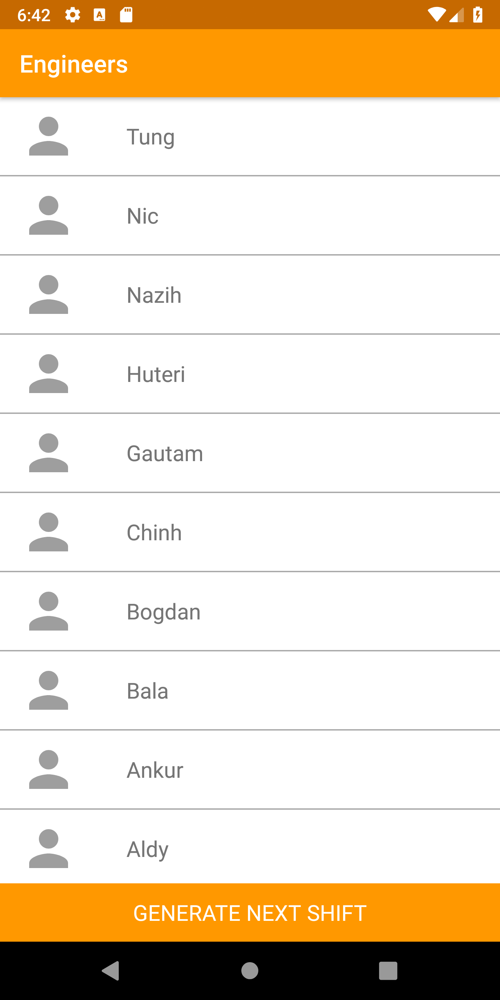
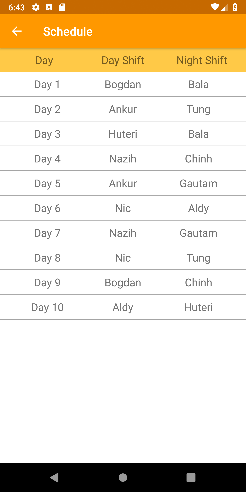
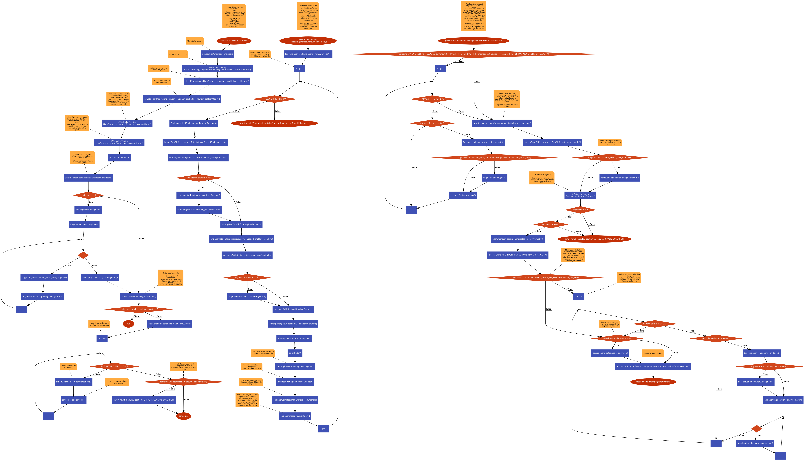

# Android-Support-Wheel-of-Fate

This is an app that should repeat selecting two engineers at random to both complete a half day of support (shift) each to ultimately generate a schedule that shows whose turn is it to support the business.

Screenshots
-------------
  
 
## Installation
Clone this repository and import into **Android Studio**
```bash
git clone https://github.com/iasmar/Android-Support-Wheel-of-Fate.git
```
## Build variants
Use the Android Studio *Build Variants* button to choose between **prod** and **qualityAssurance** and **mock** flavors combined with debug and release build types


### Building using Android Studio...

1. Open Android Studio and launch the Android SDK manager from it (Tools | Android | SDK Manager)
1. Select *Open an existing Android Studio project*
1. Select the **Android-Support-Wheel-of-Fate** directory.
1. Select the **Build variant** (mockDebug, mockQualityAssurance, prodDebug, prodQualityAssurance, prodRelease).

### Building
To build the samples after you have applied the changes above, you can use the build/run option in Android Studio, or build directly from the command line if you prefer.

 ## Built With

* [Gradle](https://guides.gradle.org/building-android-apps/)

### Configuration
 - Use [gradle.properties](https://github.com/iasmar/Android-Support-Wheel-of-Fate/blob/master/gradle.properties) to modify the current configration.

```
Example 
      - devServer=https://private-8c8ff7-astortest.apiary-mock.com/astro/
      - stagingServer=https://private-8c8ff7-astortest.apiary-mock.com/astro/
      - productionServer=https://private-8c8ff7-astortest.apiary-mock.com/astro/
```

### Tests
This project have 3 types of test:
 - [androidTest](https://github.com/iasmar/Android-Support-Wheel-of-Fate/tree/master/app/src/androidTest) Unit tests that involves android instrumentation **Real data**.
  - [androidTestMock](https://github.com/iasmar/Android-Support-Wheel-of-Fate/tree/master/app/src/androidTestMock) Unit tests that involves android instrumentation **Mock data**.
   - [androidTest](https://github.com/iasmar/Android-Support-Wheel-of-Fate/tree/master/app/src/test) Unit tests.

### Running the tests


### Algorithm code flow...
 -  [View full image size](https://raw.githubusercontent.com/iasmar/Android-Support-Wheel-of-Fate/master/algorithm_code_flow/algorithm_code_flow.png)
 - [View pdf](https://github.com/iasmar/Android-Support-Wheel-of-Fate/blob/master/algorithm_code_flow/algorithm_code_flow.pdf)
-------------
 
 
### Todos

- Write MORE Tests
- Write MORE Tests
- Write MORE Tests
- Design Pattern for Support Wheel of Fate to make it easier to add new rules or remove rules
- Micro debugger
- Toolbar title support when the orientation changed
- Remove unsed libraries
 


License
----

Copyright 2018 The Android Open Source Project, Inc.

Licensed to the Apache Software Foundation (ASF) under one or more contributor
license agreements.  See the NOTICE file distributed with this work for
additional information regarding copyright ownership.  The ASF licenses this
file to you under the Apache License, Version 2.0 (the "License"); you may not
use this file except in compliance with the License.  You may obtain a copy of
the License at

http://www.apache.org/licenses/LICENSE-2.0

Unless required by applicable law or agreed to in writing, software
distributed under the License is distributed on an "AS IS" BASIS, WITHOUT
WARRANTIES OR CONDITIONS OF ANY KIND, either express or implied.  See the
License for the specific language governing permissions and limitations under
the License.
